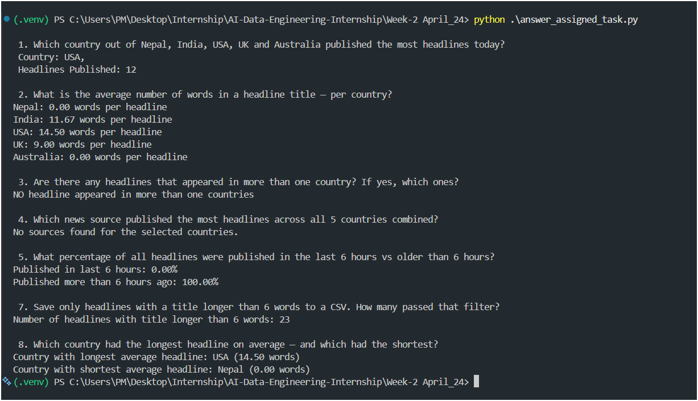

# Week-2 April_24: News Data Engineering Tasks

## Overview

This folder contains scripts and data for analyzing news headlines from the GNews API. The pipeline fetches, deduplicates, and processes news data to answer specific analytical questions about headlines from Nepal, India, USA, UK, and Australia.

## Contents

- **data_collection.py**: Fetches news from GNews API, saves to `news_data.csv`, and prevents duplicate rows.
- **news_data.csv**: Cleaned dataset of news headlines with columns: id, title, description, publishedAt, sourceCountry, url.
- **answer_assigned_task.py**: Reads the CSV and answers analytical questions, including:
  1. Which country published the most headlines today?
  2. Average headline length per country.
  3. Headlines appearing in multiple countries.
  4. Top news source across all five countries.
  5. Percentage of headlines published in the last 6 hours.
  6. (Explained in code/comments) How duplicates are prevented.
  7. Saves headlines with titles longer than 6 words to a new CSV.
  8. Country with the longest and shortest average headline.

## Requirements

- Python 3.8+
- Packages: `requests`, `python-dotenv`
- GNews API key (set in a `.env` file as `GNEWS_API_KEY`)

## Usage

1. **Install dependencies**  
   ```
   pip install requests python-dotenv
   ```

2. **Set up your API key**  
   Create a `.env` file in this folder:
   ```
   GNEWS_API_KEY=your_api_key_here
   ```

3. **Collect data**  
   ```
   python data_collection.py
   ```

4. **Run analysis**  
   ```
   python answer_assigned_task.py
   ```

## Notes

- All analysis is performed by reading from `news_data.csv` (not directly from the API).
- The pipeline ensures no duplicate headlines are saved.
- Output files (e.g., filtered headlines) are generated as needed by the scripts.

---

## Task Output


