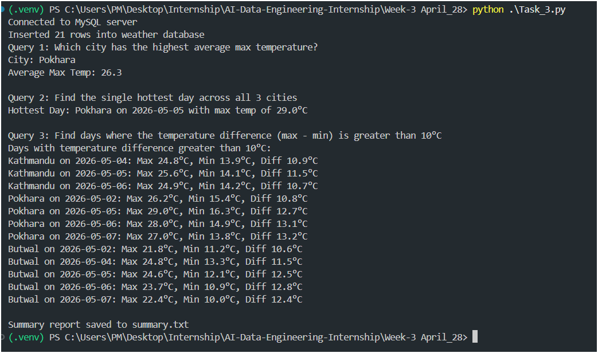
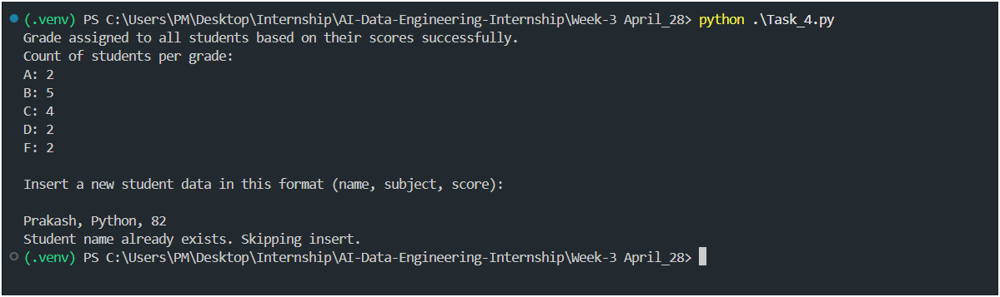

# Task 01 · Create, Insert & Query

Creates a MySQL `library` database with a `books` table, inserts 16 sample books, and runs three queries with formatted output.

## Files
- `Task_1.py` — main script
- `books_data.py` — sample book records (16 books)

## Output

---

# Task 02 · API → MySQL Pipeline

Fetches user data from an API (https://jsonplaceholder.typicode.com/users), stores it into users table.

Similarly fetches data from https://jsonplaceholder.typicode.com/posts and then inserts selected posts from `/posts`, and runs queries.

## Files
- `Task_2.py` — main script

## Output

---

# Task 03 · Weather Data + Analysis

Fetches 7-day weather forecasts for Kathmandu, Pokhara, and Butwal from the Open-Meteo API, stores the data in a MySQL `weather` database, and runs comparison queries.

## Environment Variable
- `OPEN_METEO_API_URL` — Open-Meteo forecast endpoint used by `Task_3.py`

## Files
- `Task_3.py` — main script

## Output

---

# Task 04 · Update, Delete & Data Integrity

Builds a student grade management system using `mysql.connector`, inserts sample students, assigns grades from scores, deletes failing records, adds a `passed` column for data integrity, and checks for duplicate student names before inserting.

## Files
- `Task_4.py` — main script

## Output

