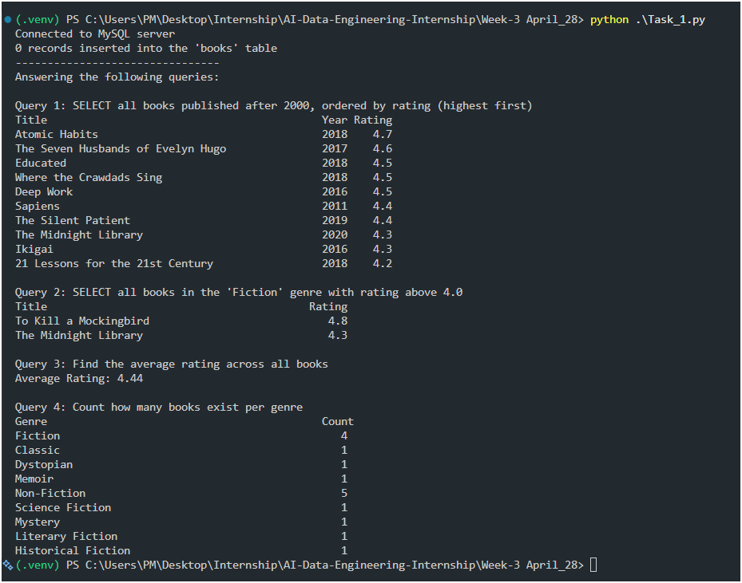
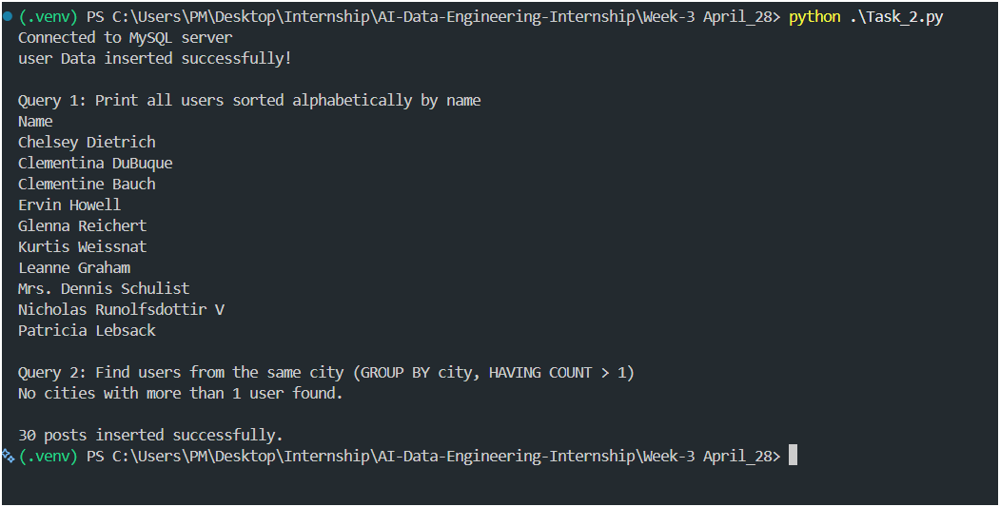

# Task 01 · Create, Insert & Query

Creates a MySQL `library` database with a `books` table, inserts 16 sample books, and runs three queries with formatted output.

## Files
- `Task_1.py` — main script
- `books_data.py` — sample book records (16 books)

## Output

---

# Task 02 · API → MySQL Pipeline

Fetches user data from an API (https://jsonplaceholder.typicode.com/users), stores it into users table.

Similarly fetches data from https://jsonplaceholder.typicode.com/posts and then inserts selected posts from `/posts`, and runs queries.

## Files
- `Task_2.py` — main script

## Output

