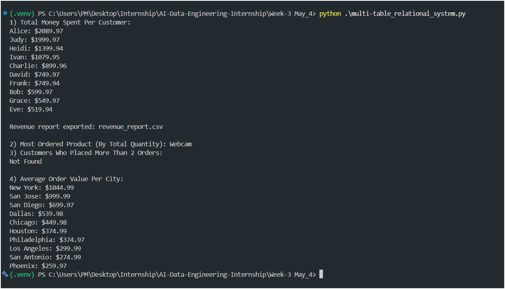
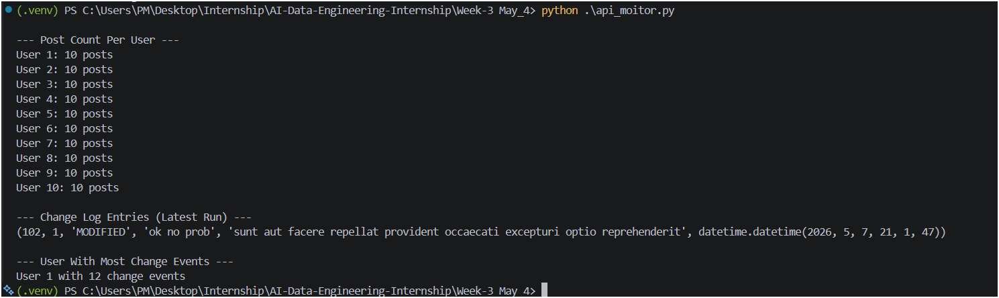

# Week-4 May_4

### Task A · Multi-Table Relational System
- Creates a `store_db` MySQL database.
- Builds `customers`, `products`, and `orders` tables with foreign keys.
- Inserts sample data with parameterized queries.
- Runs reporting queries for customer spending, top product, frequent customers, and city-wise average order value.
- Exports the revenue-per-customer report to `revenue_report.csv`.

### Task B · API Monitor with Change Detection
- Connects to `https://jsonplaceholder.typicode.com/posts`.
- Creates a `monitor_db` MySQL database.
- Stores posts in `posts` and audit events in `change_log`.
- Detects `NEW` and `MODIFIED` posts between runs.
- Uses per-run IDs to print latest-run change entries only.
- Prints post counts per user, latest run change log entries, and the user with the most change events.
- Supports rerun mismatch detection after manual DB changes (for example: `UPDATE posts SET title='Changed' WHERE post_id=1`).

## Output Images

### Task A Output

### Task B Output

