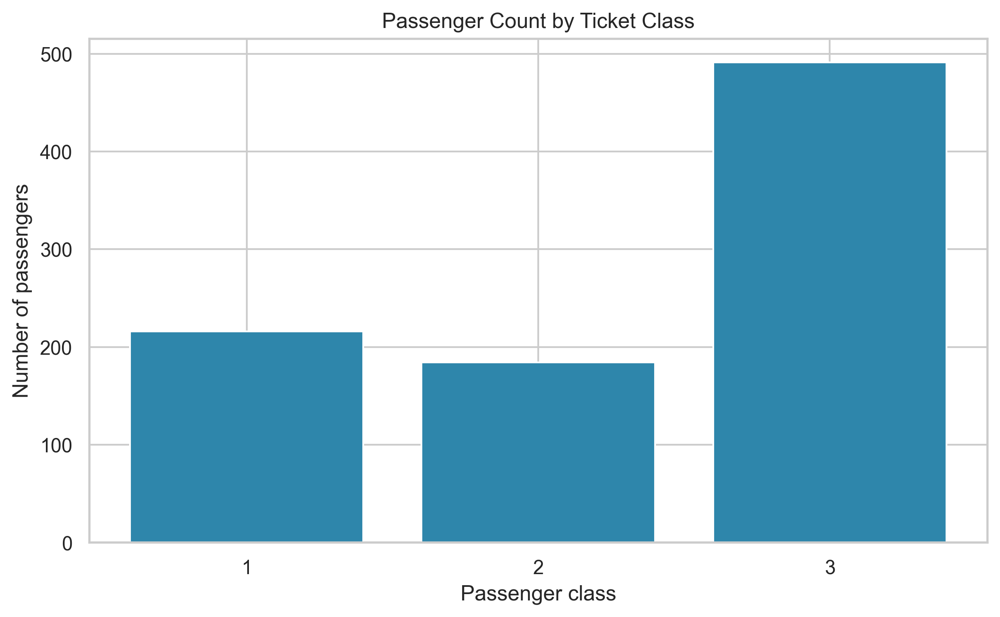
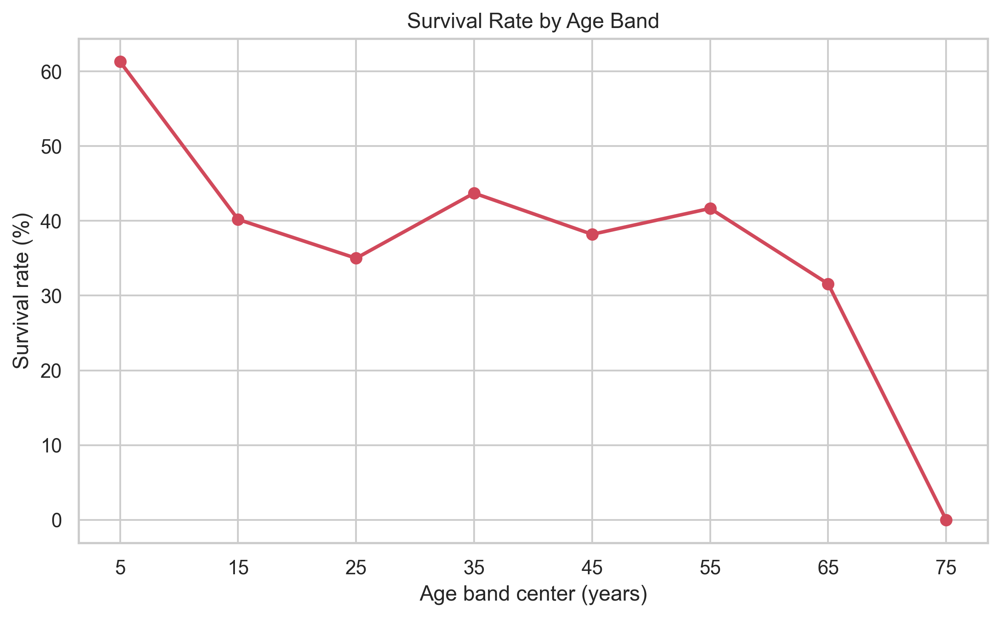
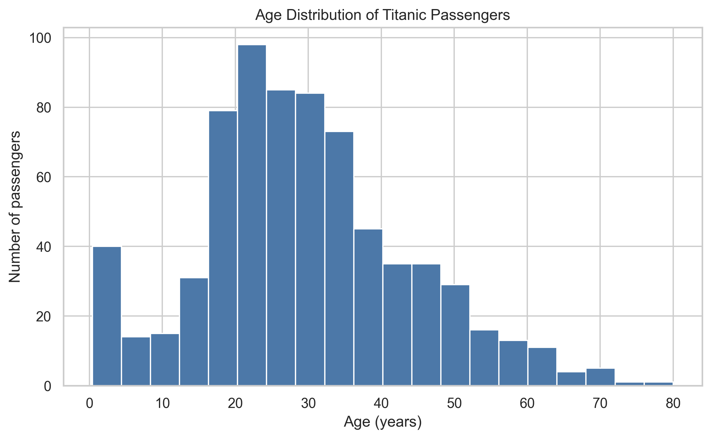
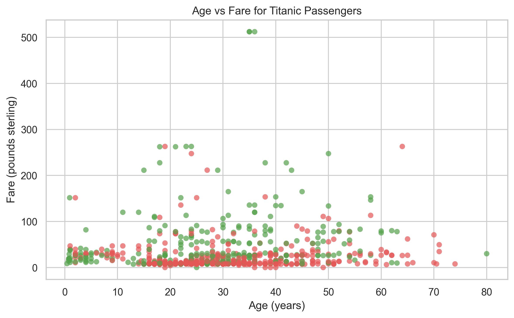
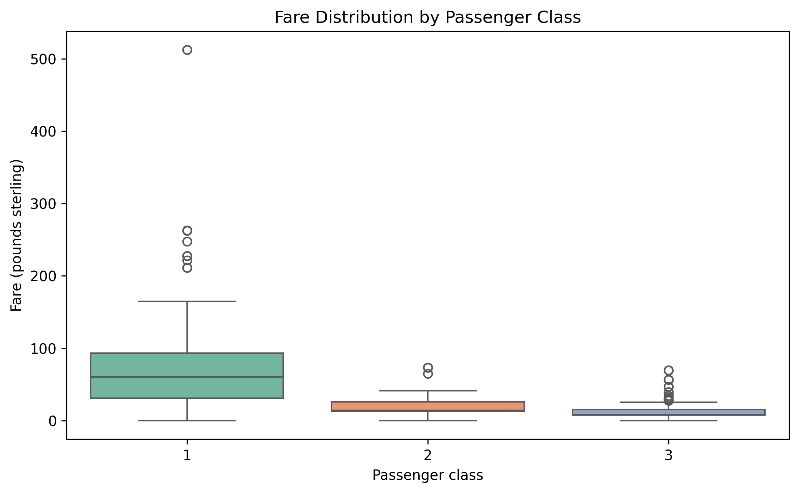
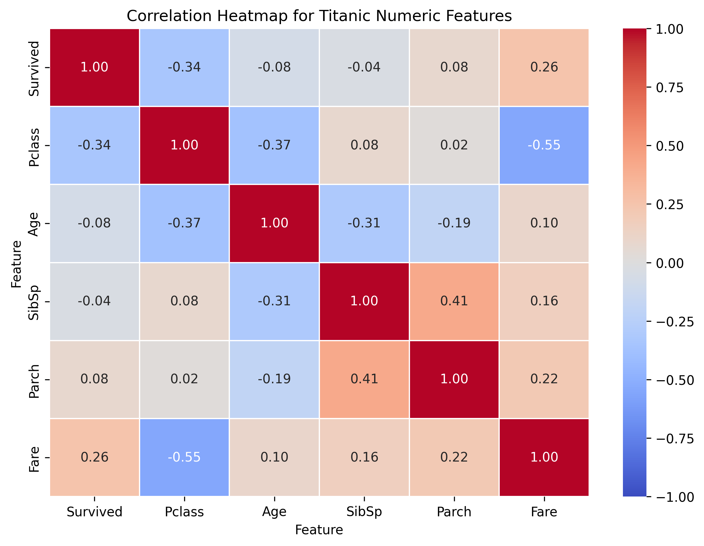
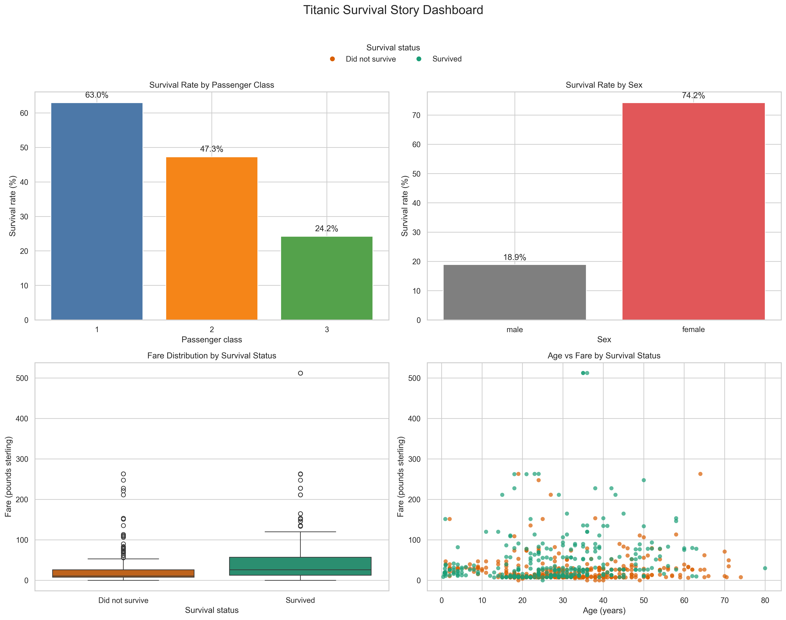

# Week 6 Outputs

## Task 1: Multi-Chart Visualization Notebook
- Notebook: [Task_01.ipynb](Task_01.ipynb)
- Output folder: [Task1](Task1)

<td>

## Task 2: Storytelling Dashboard
- Notebook: [Task_02.ipynb](Task_02.ipynb)
- Output folder: [Task2](Task2)
- Dashboard image: [task2_storytelling_dashboard.png](Task2/task2_storytelling_dashboard.png)

